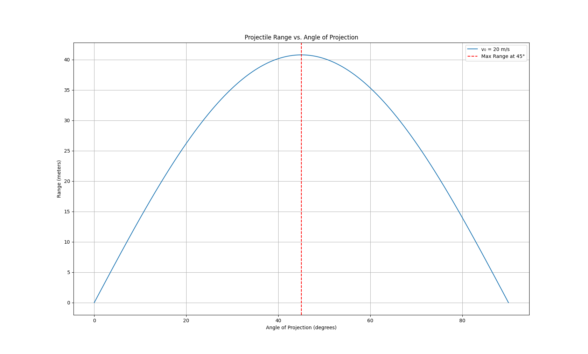

Problem 1
# Mechanics – Problem 1  
## Investigating the Range as a Function of the Angle of Projection

### 📌 Motivation
Projectile motion, while seemingly simple, offers a rich playground for exploring fundamental principles of physics. The problem is straightforward: analyze how the range of a projectile depends on its angle of projection. Yet, beneath this simplicity lies a complex and versatile framework.

What makes this topic particularly compelling is the number of free parameters involved in these equations, such as initial velocity, gravitational acceleration, and launch height. These parameters give rise to a diverse set of solutions that can describe a wide array of real-world phenomena, from the arc of a soccer ball to the trajectory of a rocket.

---

## 🧠 1. Theoretical Foundation

### Derivation of Equations of Motion

Starting from Newton’s second law:

- **Horizontal motion (no acceleration):**  
  \[
  x(t) = v_0 \cos(\theta) t
  \]

- **Vertical motion (constant downward acceleration):**  
  \[
  y(t) = v_0 \sin(\theta) t - \frac{1}{2} g t^2
  \]

Where:
- \( v_0 \): initial velocity  
- \( \theta \): angle of projection  
- \( g \): gravitational acceleration  
- \( x(t), y(t) \): position at time \( t \)

### Time of Flight

The projectile hits the ground when \( y(t) = 0 \) (assuming launch and landing heights are equal):

\[
t_{\text{flight}} = \frac{2v_0 \sin(\theta)}{g}
\]

### Horizontal Range

\[
R = v_0 \cos(\theta) \cdot t_{\text{flight}} = \frac{v_0^2 \sin(2\theta)}{g}
\]

Thus, the **range depends on**:
- \( v_0^2 \): quadratic in initial velocity
- \( \sin(2\theta) \): maximized at \( \theta = 45^\circ \)
- Inversely proportional to \( g \)

---

## 📊 2. Analysis of the Range

### Python Simulation
```python
import numpy as np
import matplotlib.pyplot as plt

# Constants
g = 9.81  # m/s^2
v0 = 20   # m/s

# Angles from 0 to 90 degrees
angles = np.linspace(0, 90, 500)
angles_rad = np.radians(angles)

# Range calculation
R = (v0**2) * np.sin(2 * angles_rad) / g

# Plotting
plt.figure(figsize=(10, 6))
plt.plot(angles, R, label=f'v₀ = {v0} m/s')
plt.xlabel('Angle of Projection (degrees)')
plt.ylabel('Range (m)')
plt.title('Projectile Range vs. Angle of Projection')
plt.grid(True)
plt.legend()
plt.axvline(45, color='red', linestyle='--', label='Maximum Range at 45°')
plt.legend()
plt.show()
```



### 📈 Observations:

- **Maximum range** occurs at \( \theta = 45^\circ \)
- **Symmetry**: The range at angle \( \theta \) is the same as at \( 90^\circ - \theta \)
- **Increasing** \( v_0 \) increases the entire curve **quadratically**
- **Increasing** \( g \) (e.g., on different planets) **compresses the range**

---

### 🌍 3. Practical Applications

- **Sports**: Optimizing throw angles in javelin, soccer, basketball  
- **Engineering**: Launching projectiles in defense or construction  
- **Astrophysics**: Trajectories of space probes under planetary gravity  
- **Education**: Classic introductory example of 2D motion

---

### 💻 4. Implementation

The included Python script simulates the range as a function of angle and allows for parameter variation:

- Change `v0` to observe effects of **initial speed**
- Modify `g` to simulate **other planets** (e.g., Moon or Mars)
- Extend to **3D** or add **drag force** for realism

---

### ⚠️ 5. Limitations and Extensions

#### Limitations:
- Neglects **air resistance**
- Assumes **level ground**
- Assumes **constant gravitational field**
- Ignores **spin or shape** of projectile

#### Possible Extensions:
- Add **quadratic drag**: \( F_{\text{drag}} \propto v^2 \)
- Model **variable terrain**: \( y(t) \ne 0 \) at impact
- Vary **initial height**: \( y_0 > 0 \)

---

### 📎 Conclusion

Projectile motion offers both **analytical beauty** and **practical relevance**.  
The range as a function of angle exhibits a clear, elegant dependence on \( \sin(2\theta) \), and this can be extended in many ways to model **real-world systems** more closely.


