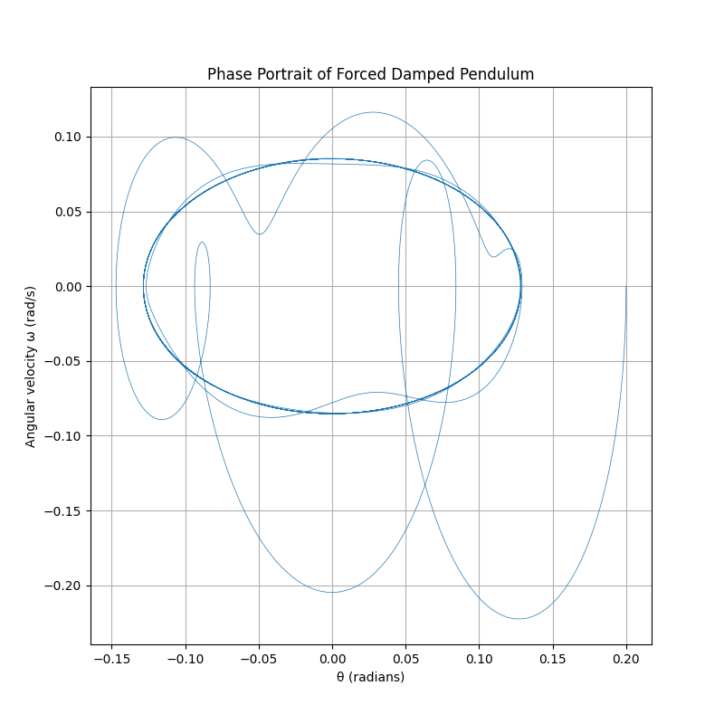

# Problem 2: Investigating the Dynamics of a Forced Damped Pendulum

## Motivation

The forced damped pendulum is a classic example of a nonlinear dynamical system exhibiting rich and complex behavior. The interplay between damping, restoring forces, and an external periodic driving force leads to phenomena such as resonance, periodic oscillations, quasiperiodicity, and chaos. This makes the forced damped pendulum a fundamental model for understanding real-world systems in physics and engineering, including driven oscillators, suspension bridges, and energy harvesting devices.

Introducing forcing adds parameters such as the amplitude and frequency of the external force. By varying these parameters and the damping coefficient, we observe a wide range of behaviors from simple periodic motion to highly irregular, chaotic dynamics.

---

## 1. Theoretical Foundation

The motion of a forced damped pendulum is governed by the nonlinear second-order differential equation:

\[
\frac{d^2 \theta}{dt^2} + \gamma \frac{d\theta}{dt} + \omega_0^2 \sin \theta = A \cos(\omega t)
\]

where:

- \(\theta\) is the angular displacement,
- \(\gamma\) is the damping coefficient,
- \(\omega_0 = \sqrt{\frac{g}{l}}\) is the natural frequency (with gravitational acceleration \(g\) and pendulum length \(l\)),
- \(A\) is the amplitude of the external driving force,
- \(\omega\) is the driving frequency.

For small angles (\(\theta \approx 0\)), the approximation \(\sin \theta \approx \theta\) linearizes the equation, allowing analytical insights into resonance conditions and steady-state solutions.

However, the full nonlinear equation must be solved numerically to explore phenomena such as chaos and complex oscillations.

---

## 2. Analysis of Dynamics

The behavior of the forced damped pendulum depends critically on the parameters:

- **Damping coefficient \(\gamma\)**: Controls energy dissipation. Low damping can allow sustained oscillations; high damping suppresses motion.
- **Driving amplitude \(A\)**: Determines the strength of the external force. Higher amplitudes can induce complex behaviors.
- **Driving frequency \(\omega\)**: Resonance occurs when \(\omega \approx \omega_0\), leading to large amplitude oscillations.

By varying these parameters, the system transitions from regular periodic motion to quasiperiodic and chaotic dynamics. The pendulum can synchronize with the drive, oscillate erratically, or even settle into complex attractors.

---

## 3. Practical Applications

The forced damped pendulum model applies to many real-world systems:

- **Engineering:** Design of suspension bridges, vibration absorbers, and mechanical oscillators.
- **Energy harvesting:** Devices that capture energy from mechanical vibrations often exploit forced oscillations.
- **Electrical circuits:** Analogous behavior occurs in driven RLC circuits.
- **Biomechanics:** Understanding human gait and oscillatory motion in biological systems.

---

## 4. Implementation: Numerical Simulation in Python

The following Python script uses numerical integration to simulate the nonlinear forced damped pendulum. The `scipy.integrate.solve_ivp` function applies a Runge-Kutta method to solve the system of first-order ODEs:

```python
import numpy as np
import matplotlib.pyplot as plt
from scipy.integrate import solve_ivp

# Parameters
g = 9.81          # gravitational acceleration (m/s^2)
l = 1.0           # pendulum length (m)
gamma = 0.5       # damping coefficient
A = 1.2           # driving force amplitude
omega_drive = 2/3 # driving frequency

omega0 = np.sqrt(g / l)  # natural frequency

# Define the system of equations
def forced_damped_pendulum(t, y):
    theta, omega = y
    dtheta_dt = omega
    domega_dt = -gamma * omega - omega0**2 * np.sin(theta) + A * np.cos(omega_drive * t)
    return [dtheta_dt, domega_dt]

# Initial conditions: small displacement and zero initial velocity
y0 = [0.2, 0.0]

# Time span and points for evaluation
t_span = (0, 100)
t_eval = np.linspace(*t_span, 5000)

# Solve the system
sol = solve_ivp(forced_damped_pendulum, t_span, y0, t_eval=t_eval, method='RK45')

# Plot angular displacement over time
plt.figure(figsize=(12, 6))
plt.plot(sol.t, sol.y[0], label='Angular displacement θ (rad)')
plt.xlabel('Time (s)')
plt.ylabel('θ (radians)')
plt.title('Forced Damped Pendulum Motion')
plt.grid(True)
plt.legend()
plt.show()
```
### 5. Visualization of Phase Space

To better understand the system’s behavior, we plot the phase portrait showing angular displacement  
\( \theta \) versus angular velocity  
\( \omega = \frac{d\theta}{dt} \):

```python
plt.figure(figsize=(8, 8))
plt.plot(sol.y[0], sol.y[1], linewidth=0.5)
plt.xlabel('θ (radians)')
plt.ylabel('Angular velocity ω (rad/s)')
plt.title('Phase Portrait of Forced Damped Pendulum')
plt.grid(True)
plt.show()
```



6. Extensions and Further Analysis

- **Poincaré Sections:** Sampling the system state at intervals equal to the driving period reveals discrete points that can classify motion types.

- **Bifurcation Diagrams:** Sweeping the driving amplitude or frequency and plotting long-term behavior illustrates transitions to chaos.

- **Nonlinear damping:** Including terms dependent on \( \omega^2 \) or velocity cubed can better model real frictional forces.

- **Non-periodic driving:** Studying random or quasi-periodic forcing introduces further complexity relevant in natural systems.

---

7. Limitations

- The small-angle approximation is insufficient for large oscillations.

- Real pendulums may experience non-ideal friction, air resistance, and structural flexibility.

- The model assumes a rigid rod and point mass bob.

- Numerical solutions may require fine time resolution and careful handling of chaotic sensitivity.

---

**Conclusion**

The forced damped pendulum offers profound insights into nonlinear dynamics, illustrating how simple systems can exhibit complex and unpredictable behavior. Numerical simulations combined with phase space analysis enable exploration beyond analytic solutions, providing a window into resonance, chaos, and real-world oscillatory phenomena.
