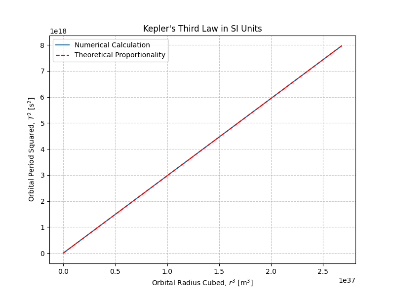
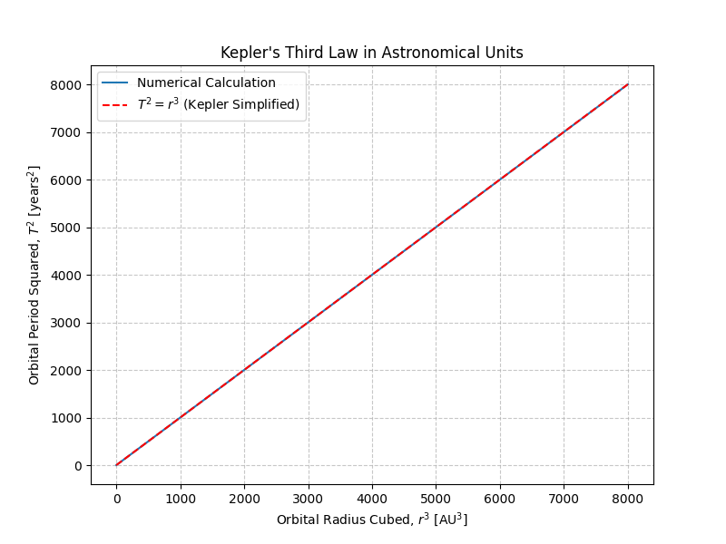

# Problem 1: Orbital Period and Orbital Radius

## Motivation

Kepler’s Third Law reveals a profound connection between the time it takes a celestial object to complete an orbit and its distance from the object it orbits. It’s a cornerstone in celestial mechanics, useful for estimating distances, predicting motion, and determining masses of astronomical objects. This relationship, when derived from Newtonian gravitation, also helps bridge classical and modern physics.

---

## 1. Theoretical Derivation

Consider a small object of mass \( m \) orbiting a large central mass \( M \) in a **circular orbit** of radius \( r \) and period \( T \).

### Gravitational Force Provides Centripetal Force

$$
F_{\text{gravity}} = F_{\text{centripetal}}
$$

$$
\frac{G M m}{r^2} = \frac{m v^2}{r}
$$

Canceling \( m \) and rearranging:

$$
v^2 = \frac{G M}{r}
$$

Substitute \( v = \frac{2\pi r}{T} \):

$$
\left( \frac{2\pi r}{T} \right)^2 = \frac{G M}{r}
$$

$$
\frac{4\pi^2 r^2}{T^2} = \frac{G M}{r}
$$

$$
T^2 = \frac{4\pi^2 r^3}{G M}
$$

✅ **Kepler’s Third Law for Circular Orbits**:
$$
T^2 \propto r^3
$$


This shows the square of the orbital period is proportional to the cube of the orbital radius.

---

## 2. Astronomical Implications

- Used to **calculate planetary distances** when the period is known (and vice versa).
- Allows estimation of the **mass of central objects** (e.g., planets, stars).
- Critical in **satellite deployment**, **planet hunting**, and **galactic dynamics**.

---

## 3. Real-World Examples

### Example 1: The Moon Orbiting Earth

Given:
- Orbital radius: \( r = 3.84 \times 10^8 \, \text{m} \)
- Mass of Earth: \( M = 5.972 \times 10^{24} \, \text{kg} \)
- Gravitational constant: \( G = 6.67430 \times 10^{-11} \, \text{m}^3\,\text{kg}^{-1}\,\text{s}^{-2} \)

Using the orbital period formula:

$$
T = 2\pi \sqrt{\frac{r^3}{G M}} \approx 2.36 \times 10^6 \, \text{s} \approx 27.3 \, \text{days}
$$

This matches the observed sidereal period of the Moon.

---
### Example 2: Planetary Orbits in the Solar System

When using **astronomical units (AU)** for distance and **years** for time, Kepler’s Third Law simplifies to:

T² = r³

where  
- T is the orbital period in years  
- r is the orbital radius in AU  

For example:

- **Earth**:  
  r = 1 AU ⇒ T = 1 year

- **Mars**:  
  r = 1.52 AU ⇒ T² = (1.52)³ = 3.51 ⇒ T = √3.51 ≈ 1.87 years

This matches well with the actual orbital period of Mars.

---


## 4. Python Simulation and Visualization

```python
import numpy as np
import matplotlib.pyplot as plt

# Constants
G = 6.67430e-11  # m^3/kg/s^2
M = 1.989e30     # Mass of the Sun in kg

# Orbital radii (in meters)
radii = np.linspace(5e10, 3e12, 100)  # From 0.33 AU to ~20 AU

# Calculate periods using Kepler's Third Law
periods = 2 * np.pi * np.sqrt(radii**3 / (G * M))

# Plot T^2 vs r^3 to show the linear relationship
plt.figure(figsize=(8, 6))
plt.plot(radii**3, periods**2)
plt.xlabel('Orbital Radius Cubed (r³) [m³]')
plt.ylabel('Orbital Period Squared (T²) [s²]')
plt.title('Kepler’s Third Law: T² vs r³')
plt.grid(True)
plt.show()
```



## 5. Extension: Elliptical Orbits

For elliptical orbits, Kepler’s Third Law generalizes to:

$$
T^2 = \frac{4 \pi^2}{G M} a^3
$$

where  
- \( T \) is the orbital period,  
- \( a \) is the semi-major axis of the ellipse,  
- \( G \) is the gravitational constant,  
- \( M \) is the mass of the central body.

The relationship still holds true, making Kepler’s Third Law a powerful tool even beyond circular orbit approximations.


## 6. Conclusion

Kepler’s Third Law, derived from Newtonian mechanics, elegantly explains the orbital dynamics of planets and satellites. It allows astronomers to deduce distances and masses from simple observations and remains foundational in both theoretical and applied astrophysics.
