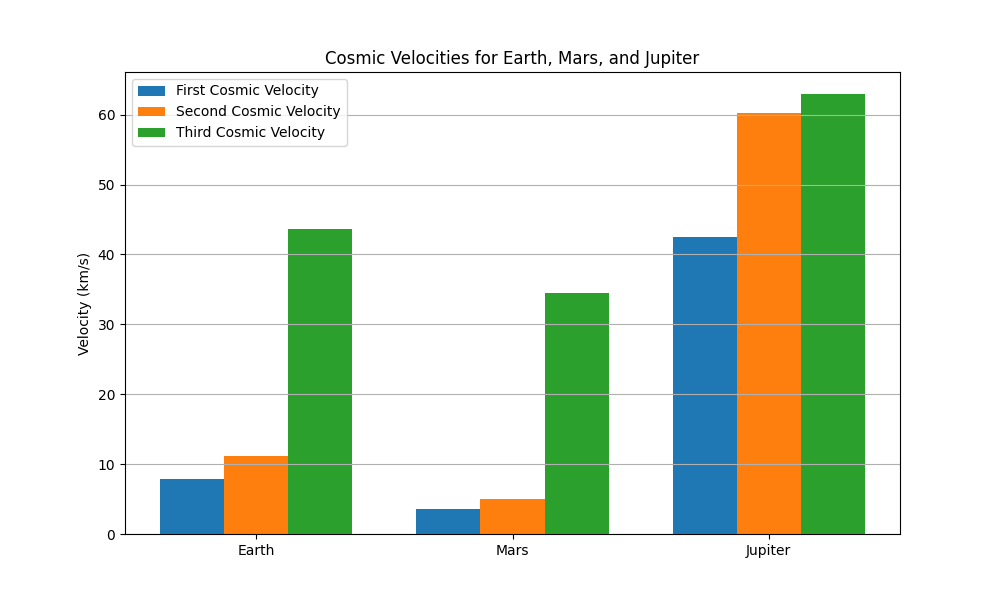

# Escape Velocities and Cosmic Velocities

## Motivation

Understanding escape velocity is fundamental to grasping how spacecraft leave a celestial body's gravitational influence. Beyond escape velocity, the first, second, and third cosmic velocities set thresholds for orbiting a planet, escaping it, and even leaving the star system. These concepts are the foundation of launching satellites, planning interplanetary missions, and envisioning future interstellar travel.

---

## Definitions of Cosmic Velocities

- **First Cosmic Velocity (Orbital Velocity)**  
  The minimum velocity an object must have to stay in a **stable low circular orbit** around a celestial body without falling back to the surface.  
  Physically: It balances gravitational pull with centripetal force to maintain orbit.

- **Second Cosmic Velocity (Escape Velocity)**  
  The minimum velocity needed to **escape the gravitational field** of the celestial body completely without further propulsion.  
  Physically: It allows an object to reach infinite distance with zero kinetic energy left.

- **Third Cosmic Velocity (Solar System Escape Velocity)**  
  The minimum velocity required to **escape the gravitational influence of the star system** (e.g., the Sun), assuming the object starts from the planet's surface.  
  Physically: It combines escape from the planet plus the additional velocity to overcome the star's gravity.

---

## Mathematical Derivations

### 1. First Cosmic Velocity \( v_1 \)

For a circular orbit of radius \( r \) (usually the planet’s radius plus altitude, but here surface orbit is approximated as radius \( R \)):

$$
v_1 = \sqrt{\frac{GM}{R}}
$$
Where:

- \( G \) is the universal gravitational constant, approximately  
  $$
  G \approx 6.67430 \times 10^{-11} \, \text{m}^3 \text{kg}^{-1} \text{s}^{-2}
  $$

- \( M \) is the mass of the celestial body (kg).

- \( R \) is the radius of the celestial body (m).

---

### 2. Second Cosmic Velocity \( v_2 \) (Escape velocity from the planet)

The escape velocity is derived from energy conservation, where the kinetic energy equals the gravitational potential energy required to escape the gravitational field of the planet.

$$
v_2 = \sqrt{\frac{2GM}{R}} = \sqrt{2} \, v_1
$$

---

### 3. Third Cosmic Velocity \( v_3 \) (Escape velocity from the star system)

This velocity corresponds to the minimum speed needed to escape the gravitational influence of the star system (e.g., the Sun), assuming the spacecraft is launched from the surface of the planet.

The spacecraft must overcome the gravitational potentials of both the planet and the star at the planet’s orbital radius.

Let:

- \( r_s \) be the orbital radius of the planet around the star (distance from the star to the planet).

- \( M_s \) be the mass of the star.

Then,

$$
v_3 = \sqrt{v_2^2 + v_{\text{esc,star}}^2}
$$

where

$$
v_{\text{esc,star}} = \sqrt{\frac{2GM_s}{r_s}}
$$

and \( v_2 \) is the escape velocity from the planet as above.

---

### Parameters for Earth, Mars, and Jupiter

| Body    | Mass (kg)                 | Radius (m)               | Orbital Radius from Sun (m)   |
|---------|---------------------------|--------------------------|-------------------------------|
| Earth   | \(5.972 \times 10^{24}\)  | \(6.371 \times 10^{6}\)  | \(1.496 \times 10^{11}\)      |
| Mars    | \(6.39 \times 10^{23}\)   | \(3.3895 \times 10^{6}\) | \(2.279 \times 10^{11}\)      |
| Jupiter | \(1.898 \times 10^{27}\)  | \(6.9911 \times 10^{7}\) | \(7.785 \times 10^{11}\)      |

Sun mass:

$$
M_s = 1.989 \times 10^{30} \, \text{kg}
$$


## Python Code to Calculate and Visualize Cosmic Velocities

```python
import numpy as np
import matplotlib.pyplot as plt

# Constants
G = 6.67430e-11  # Gravitational constant (m^3 kg^-1 s^-2)
M_sun = 1.989e30  # Mass of the Sun (kg)

# Celestial bodies data
bodies = {
    "Earth": {
        "mass": 5.972e24,
        "radius": 6.371e6,
        "orbit_radius": 1.496e11
    },
    "Mars": {
        "mass": 6.39e23,
        "radius": 3.3895e6,
        "orbit_radius": 2.279e11
    },
    "Jupiter": {
        "mass": 1.898e27,
        "radius": 6.9911e7,
        "orbit_radius": 7.785e11
    }
}

# Compute velocities
results = {}
for body, data in bodies.items():
    M = data["mass"]
    R = data["radius"]
    r_s = data["orbit_radius"]
    
    v1 = np.sqrt(G * M / R)                          # First cosmic velocity (orbit)
    v2 = np.sqrt(2 * G * M / R)                      # Second cosmic velocity (escape planet)
    v_esc_star = np.sqrt(2 * G * M_sun / r_s)       # Escape velocity from Sun at planet orbit
    v3 = np.sqrt(v2**2 + v_esc_star**2)              # Third cosmic velocity (escape star system)
    
    results[body] = {
        "First Cosmic Velocity (km/s)": v1 / 1000,
        "Second Cosmic Velocity (km/s)": v2 / 1000,
        "Third Cosmic Velocity (km/s)": v3 / 1000
    }

# Display results
for body, velocities in results.items():
    print(f"{body}:")
    for desc, val in velocities.items():
        print(f"  {desc}: {val:.2f} km/s")
    print()

# Visualization
labels = list(results.keys())
v1_vals = [results[b]["First Cosmic Velocity (km/s)"] for b in labels]
v2_vals = [results[b]["Second Cosmic Velocity (km/s)"] for b in labels]
v3_vals = [results[b]["Third Cosmic Velocity (km/s)"] for b in labels]

x = np.arange(len(labels))
width = 0.25

fig, ax = plt.subplots(figsize=(10,6))
ax.bar(x - width, v1_vals, width, label='First Cosmic Velocity')
ax.bar(x, v2_vals, width, label='Second Cosmic Velocity')
ax.bar(x + width, v3_vals, width, label='Third Cosmic Velocity')

ax.set_ylabel('Velocity (km/s)')
ax.set_title('Cosmic Velocities for Earth, Mars, and Jupiter')
ax.set_xticks(x)
ax.set_xticklabels(labels)
ax.legend()
ax.grid(True, axis='y')

plt.show()
```


## Discussion and Importance in Space Exploration

The **First Cosmic Velocity** is essential for satellites. Any satellite must reach at least this velocity to maintain a stable orbit, preventing it from falling back to the planet. For Earth, this velocity is about 7.9 km/s.

The **Second Cosmic Velocity** (Escape Velocity) is critical for spacecraft leaving a planet's gravity without continuous propulsion. Rockets must accelerate beyond this velocity to enter interplanetary trajectories.

The **Third Cosmic Velocity** relates to leaving the star system entirely, enabling potential interstellar missions. It requires combining escape from the planet plus enough velocity to overcome the star's gravity. For Earth, this is around 16.7 km/s.

These velocities guide mission planning, fuel requirements, and the design of propulsion systems. Understanding and achieving them are the backbone of satellite launches, interplanetary probes (e.g., Mars rovers), and future interstellar exploration concepts.

---

## Summary

- **First cosmic velocity** — orbital velocity around a planet.

- **Second cosmic velocity** — escape velocity from the planet.

- **Third cosmic velocity** — escape velocity from the star system (e.g., the Sun).

These velocities vary by celestial body due to differences in mass, radius, and distance from the star, reflecting their unique gravitational environments.
