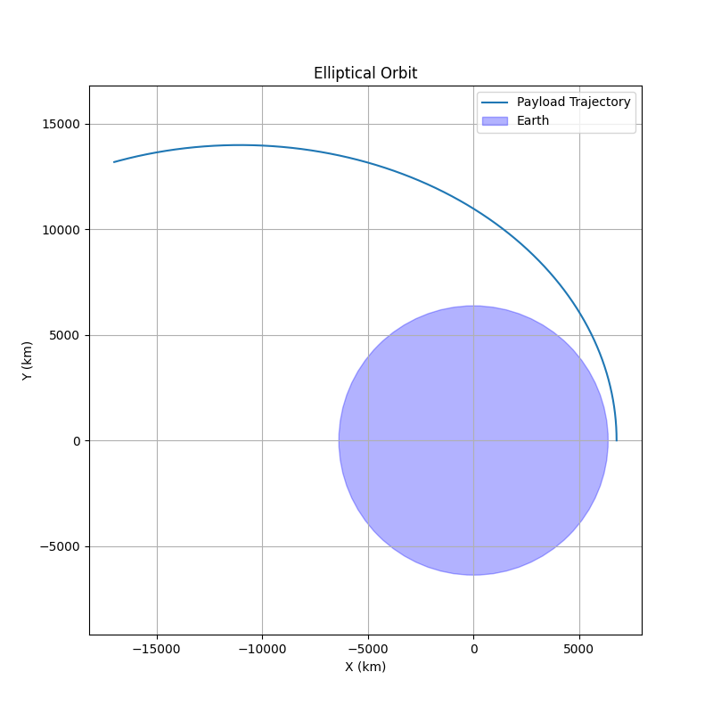
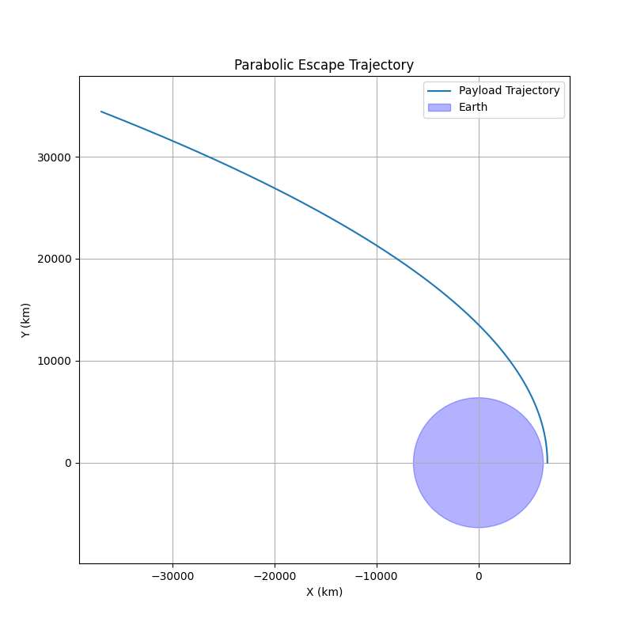
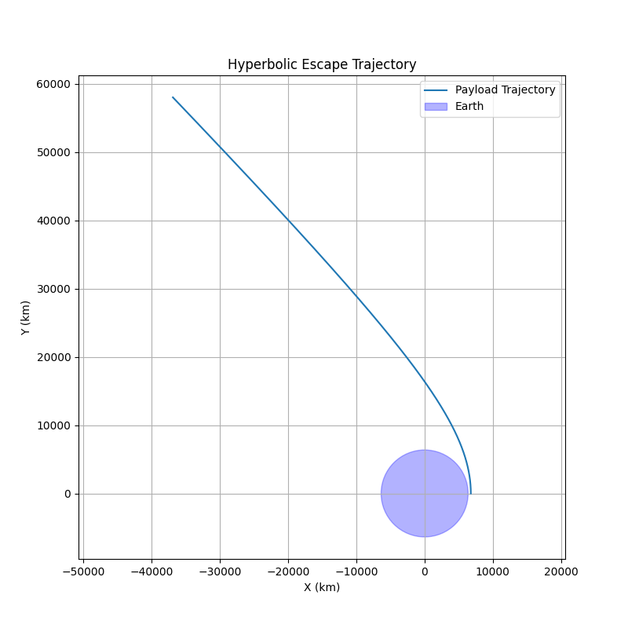

# Problem 3: Trajectories of a Freely Released Payload Near Earth

## 1. Introduction and Theory

When a payload is released from a moving rocket near Earth, its motion is influenced primarily by Earth's gravity. The trajectory depends on the initial velocity, position, and altitude. Based on these initial conditions, the path can be one of the following:

- **Elliptical orbit** (closed orbit around Earth),
- **Parabolic trajectory** (the borderline between bound and unbound orbits),
- **Hyperbolic trajectory** (escape trajectory).

### Governing Physics

The gravitational force acting on the payload is described by **Newton's Law of Gravitation**:

$$
\mathbf{F} = -\frac{GMm}{r^2} \hat{r}
$$

where:

- \( G \) is the gravitational constant, \(6.67430 \times 10^{-11} \, \mathrm{m}^3 \mathrm{kg}^{-1} \mathrm{s}^{-2} \),
- \( M \) is the mass of Earth, \(5.972 \times 10^{24} \, \mathrm{kg} \),
- \( m \) is the payload mass (which cancels out in the acceleration),
- \( r \) is the distance from Earth's center to the payload,
- \( \hat{r} \) is the unit vector pointing from Earth to the payload.

The equation of motion under Earth's gravity is:

$$
\mathbf{\ddot{r}} = -\frac{GM}{r^3} \mathbf{r}
$$

where \(\mathbf{r}\) is the position vector of the payload relative to Earth's center.

### Escape Velocity

The **escape velocity** at distance \(r\) from Earth's center is:

$$
v_{\mathrm{esc}} = \sqrt{\frac{2GM}{r}}
$$

- If the payload's velocity \(v < v_{\mathrm{esc}}\), it follows an **elliptical** orbit.
- If \(v = v_{\mathrm{esc}}\), it follows a **parabolic** trajectory.
- If \(v > v_{\mathrm{esc}}\), it follows a **hyperbolic** trajectory and escapes Earth.

---

## 2. Numerical Method and Simulation Setup

To analyze the trajectory numerically, we solve the second-order differential equation of motion by converting it into a system of first-order ordinary differential equations (ODEs):

Define the state vector:

$$
\mathbf{y} = (x, y, v_x, v_y)
$$

where \((x,y)\) is the payload position and \((v_x, v_y)\) are the velocity components in a 2D plane.

The equations become:

$$
\begin{cases}
\dot{x} = v_x \\
\dot{y} = v_y \\
\dot{v_x} = -\frac{GM}{r^3} x \\
\dot{v_y} = -\frac{GM}{r^3} y
\end{cases}
$$

with

$$
r = \sqrt{x^2 + y^2}
$$

We use numerical ODE solvers such as Python's `scipy.integrate.solve_ivp` to simulate the motion over time, given initial conditions for position and velocity.

## 3. Python Implementation for Trajectory Simulation

The following Python script numerically simulates the payload's trajectory under Earth's gravity using the `scipy.integrate.solve_ivp` solver. It models the 2D motion by solving the system of ordinary differential equations derived in the previous section.

```python
import numpy as np
import matplotlib.pyplot as plt
from scipy.integrate import solve_ivp

# Constants
G = 6.67430e-11      # gravitational constant, m^3 kg^-1 s^-2
M = 5.972e24         # mass of Earth, kg
R_earth = 6371e3     # radius of Earth, meters

def gravity_ode(t, y):
    x, y_pos, vx, vy = y
    r = np.sqrt(x**2 + y_pos**2)
    ax = -G * M * x / r**3
    ay = -G * M * y_pos / r**3
    return [vx, vy, ax, ay]

def simulate_trajectory(initial_pos, initial_vel, t_span=[0, 5000], max_step=1):
    y0 = [initial_pos[0], initial_pos[1], initial_vel[0], initial_vel[1]]
    sol = solve_ivp(gravity_ode, t_span, y0, max_step=max_step, rtol=1e-8)
    return sol

def plot_trajectory(sol, title='Payload Trajectory'):
    x = sol.y[0] / 1e3  # convert meters to kilometers
    y = sol.y[1] / 1e3

    plt.figure(figsize=(8, 8))
    plt.plot(x, y, label='Payload Trajectory')
    earth = plt.Circle((0, 0), R_earth / 1e3, color='b', alpha=0.3, label='Earth')
    plt.gca().add_patch(earth)

    plt.xlabel('X (km)')
    plt.ylabel('Y (km)')
    plt.title(title)
    plt.axis('equal')
    plt.legend()
    plt.grid(True)
    plt.show()

# Example initial conditions:

altitude = 400e3  # 400 km above Earth's surface
r0 = R_earth + altitude

# Initial position at (r0, 0)
initial_pos = np.array([r0, 0])

# Circular orbital velocity at altitude
v_circular = np.sqrt(G * M / r0)

# Initial velocities for different trajectories
initial_vel_circular = np.array([0, v_circular])              # Circular orbit
initial_vel_elliptical = np.array([0, 0.9 * np.sqrt(2) * v_circular])  # Elliptical orbit
initial_vel_parabolic = np.array([0, np.sqrt(2) * v_circular])          # Parabolic escape
initial_vel_hyperbolic = np.array([0, 1.1 * np.sqrt(2) * v_circular])  # Hyperbolic escape

# Run simulations
sol_circular = simulate_trajectory(initial_pos, initial_vel_circular)
sol_elliptical = simulate_trajectory(initial_pos, initial_vel_elliptical)
sol_parabolic = simulate_trajectory(initial_pos, initial_vel_parabolic, t_span=[0, 10000])
sol_hyperbolic = simulate_trajectory(initial_pos, initial_vel_hyperbolic, t_span=[0, 10000])

# Plot the results
plot_trajectory(sol_circular, 'Circular Orbit')
plot_trajectory(sol_elliptical, 'Elliptical Orbit')
plot_trajectory(sol_parabolic, 'Parabolic Escape Trajectory')
plot_trajectory(sol_hyperbolic, 'Hyperbolic Escape Trajectory')
```





## 4. Discussion

- **Elliptical orbit:** Initial velocity is less than the escape velocity; the payload remains gravitationally bound, orbiting Earth.

- **Parabolic trajectory:** Payload escapes Earth but with zero excess velocity at infinity — representing a delicate boundary case between bound and unbound orbits.

- **Hyperbolic trajectory:** Payload escapes Earth with positive excess velocity, meaning it will not return.

- **Circular orbit:** A special case of an elliptical orbit where the velocity is exactly the circular orbital velocity at the given altitude.

---

## 5. Real-World Applications

- **Orbital insertion:** Adjusting the payload’s velocity to achieve elliptical or circular orbits around Earth.

- **Reentry scenarios:** Payload velocity decreases so the trajectory intersects Earth's atmosphere, enabling controlled return.

- **Escape trajectories:** Missions designed to leave Earth orbit entirely (e.g., interplanetary probes and deep space missions).


