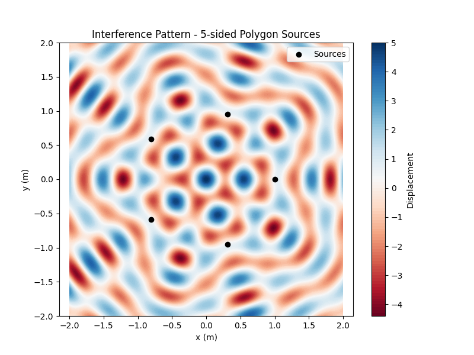

# Problem 1: Interference Patterns on a Water Surface

## Motivation

Interference occurs when waves from different sources overlap, creating new patterns. On a water surface, this phenomenon can be observed as ripples from different points meet, forming distinctive interference patterns. These patterns visually demonstrate how waves combine—either reinforcing each other (constructive interference) or canceling out (destructive interference).

Studying these patterns deepens understanding of wave behavior and phase relationships in a simple, intuitive way. This hands-on approach is useful for exploring wave physics and real-world applications such as acoustics, optics, and fluid dynamics.

---

## Problem Statement

A circular wave on a water surface, emanating from a point source located at $\mathbf{r}_i$,  
can be described by the **Single Disturbance equation**:

$$
\eta(\mathbf{r}, t) = A \cos(k r - \omega t + \phi)
$$

where:  
- $\eta(\mathbf{r}, t)$ is the displacement of the water surface at position $\mathbf{r}$ and time $t$,  
- $A$ is the amplitude of the wave,  
- $k = \frac{2\pi}{\lambda}$ is the wave number, with $\lambda$ the wavelength,  
- $\omega = 2 \pi f$ is the angular frequency, with $f$ the frequency,  
- $r = |\mathbf{r} - \mathbf{r}_i|$ is the distance from the source at $\mathbf{r}_i$ to the point $\mathbf{r}$,  
- $\phi$ is the initial phase.

---

## Steps to Follow

1. **Select a Regular Polygon**  
   Choose a regular polygon (e.g., equilateral triangle, square, regular pentagon).

2. **Position the Sources**  
   Place point wave sources at the vertices of the selected polygon, each at position $\mathbf{r}_i$.

3. **Wave Equations**  
   Write the wave equation emitted from each source $i$:

   $$
   \eta_i(\mathbf{r}, t) = A \cos(k |\mathbf{r} - \mathbf{r}_i| - \omega t + \phi_i)
   $$

   Assuming all sources have the same amplitude $A$, wavelength $\lambda$, frequency $f$,  
   and phase $\phi_i = 0$ for coherence.

4. **Superposition of Waves**  
   Apply the principle of superposition by summing the displacements from all $N$ sources:

   $$
   \eta_{\mathrm{total}}(\mathbf{r}, t) = \sum_{i=1}^N \eta_i(\mathbf{r}, t) = \sum_{i=1}^N A \cos(k |\mathbf{r} - \mathbf{r}_i| - \omega t)
   $$

5. **Analyze Interference Patterns**  
   Analyze $\eta_{\mathrm{total}}(\mathbf{r}, t)$ as a function of position $\mathbf{r}$ and time $t$  
   to identify regions of:

   - **Constructive interference:** where waves reinforce ($\eta$ maxima),  
   - **Destructive interference:** where waves cancel out ($\eta$ minima).

6. **Visualization**  
   Create graphical representations of the interference patterns on the water surface for the chosen polygon.

---


## 3. Python Simulation Implementation

Below is a Python script that simulates the interference pattern on the water surface due to wave sources placed at the vertices of a regular polygon. It calculates the total displacement of the water surface over a 2D grid at a fixed time, illustrating the constructive and destructive interference regions.

```python
import numpy as np
import matplotlib.pyplot as plt

def polygon_vertices(radius, n_sides):
    """
    Compute vertices of a regular polygon centered at origin.
    
    radius: distance from center to each vertex (meters)
    n_sides: number of vertices (polygon sides)
    """
    angles = np.linspace(0, 2 * np.pi, n_sides, endpoint=False)
    x = radius * np.cos(angles)
    y = radius * np.sin(angles)
    return np.vstack((x, y)).T  # shape (n_sides, 2)

def wave_displacement(points, sources, k, omega, t, A=1.0):
    """
    Calculate total displacement at grid points due to all sources at time t.
    
    points: array of shape (num_points, 2) with (x, y) positions
    sources: array of shape (num_sources, 2) with (x, y) source positions
    k: wave number (2pi / wavelength)
    omega: angular frequency (2pi * frequency)
    t: time (seconds)
    A: amplitude
    """
    displacement = np.zeros(points.shape[0])
    for source in sources:
        r = np.linalg.norm(points - source, axis=1)
        r[r == 0] = 1e-10  # prevent division by zero
        displacement += A * np.cos(k * r - omega * t)
    return displacement

# Simulation parameters
n_sides = 5              # number of polygon sides, e.g. pentagon
radius = 1.0             # distance from center to vertices (meters)
wavelength = 0.5         # meters
frequency = 1.0          # Hz
k = 2 * np.pi / wavelength
omega = 2 * np.pi * frequency
amplitude = 1.0
time = 0.0               # time instant for snapshot

# Generate polygon vertices (sources)
sources = polygon_vertices(radius, n_sides)

# Create grid points for simulation
x = np.linspace(-2, 2, 400)
y = np.linspace(-2, 2, 400)
X, Y = np.meshgrid(x, y)
points = np.vstack([X.ravel(), Y.ravel()]).T

# Calculate total wave displacement at each grid point
displacement = wave_displacement(points, sources, k, omega, time, amplitude)
Z = displacement.reshape(X.shape)

# Plotting the interference pattern
plt.figure(figsize=(8, 6))
plt.contourf(X, Y, Z, levels=100, cmap='RdBu')
plt.colorbar(label='Displacement')
plt.scatter(sources[:, 0], sources[:, 1], color='black', label='Sources')
plt.title(f'Interference Pattern - {n_sides}-sided Polygon Sources')
plt.xlabel('x (m)')
plt.ylabel('y (m)')
plt.legend()
plt.axis('equal')
plt.show()
```


---

## Considerations

- All sources emit waves with identical amplitude $A$, wavelength $\lambda$, and frequency $f$.


- The waves are coherent, maintaining constant phase relationships.  
- Numerical simulation tools such as Python (with NumPy and Matplotlib) are used for modeling and visualization.  

---

## Deliverables

- A Markdown document including the Python script or notebook implementing the simulation.  
- A detailed explanation of the interference patterns observed, related to the polygon shape and wave parameters.  
- Graphical representations showing regions of constructive and destructive interference on the water surface.
