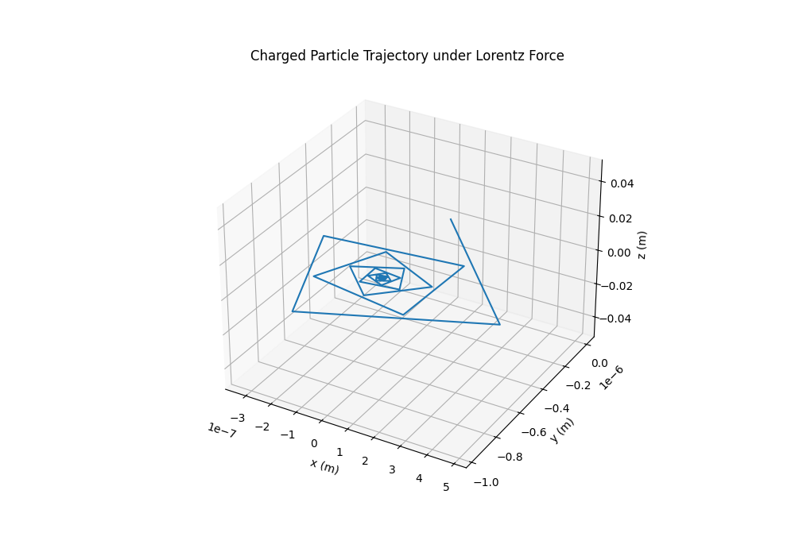

# Electromagnetism

## Problem 1  
### Simulating the Effects of the Lorentz Force

### Motivation
The Lorentz force, expressed as  
$$
\mathbf{F} = q(\mathbf{E} + \mathbf{v} \times \mathbf{B})
$$  
governs the motion of charged particles in electric and magnetic fields. It is foundational in fields like plasma physics, particle accelerators, and astrophysics. By focusing on simulations, we can explore practical applications and visualize the complex trajectories that arise due to this force.

---

### Task

1. **Exploration of Applications:**  
   - Identify systems where the Lorentz force plays a key role (e.g., particle accelerators, mass spectrometers, plasma confinement).  
   - Discuss the relevance of electric ($\mathbf{E}$) and magnetic ($\mathbf{B}$) fields in controlling the motion of charged particles.

2. **Simulating Particle Motion:**  
   Implement a simulation to compute and visualize the trajectory of a charged particle under:  
   - A uniform magnetic field.  
   - Combined uniform electric and magnetic fields.  
   - Crossed electric and magnetic fields.  
   
   Simulate the particle’s circular, helical, or drift motion based on initial conditions and field configurations.

3. **Parameter Exploration:**  
   Allow variations in:  
   - Field strengths ($\mathbf{E}$, $\mathbf{B}$).  
   - Initial particle velocity ($\mathbf{v}_0$).  
   - Charge and mass of the particle ($q$, $m$).  
   
   Observe how these parameters influence the trajectory.

4. **Visualization:**  
   - Create clear, labeled plots showing the particle’s path in 2D and 3D for different scenarios.  
   - Highlight physical phenomena such as the Larmor radius and drift velocity.

---

### Deliverables

- A Markdown document with Python script or notebook implementing the simulations.  
- Visualizations of particle trajectories for the specified field configurations.  
- A discussion on how the results relate to practical systems, such as cyclotrons or magnetic traps.  
- Suggestions for extending the simulation to more complex scenarios, such as non-uniform fields.

---

### Hints and Resources

- Use numerical methods like the Euler or Runge-Kutta method to solve the equations of motion.  
- Employ Python libraries such as NumPy for calculations and Matplotlib for visualizations.  
- Start with simple cases (e.g., uniform magnetic field) and gradually add complexity (e.g., crossed fields).  

---

### Python Implementation: Lorentz Force Simulation

```python
import numpy as np
import matplotlib.pyplot as plt
from mpl_toolkits.mplot3d import Axes3D

# Constants
q = 1.6e-19  # charge (C)
m = 9.11e-31  # mass (kg)

# Fields (can modify)
E = np.array([0.0, 0.0, 0.0])  # Electric field (V/m)
B = np.array([0.0, 0.0, 1.0])  # Magnetic field (T)

# Initial conditions
r0 = np.array([0.0, 0.0, 0.0])  # initial position (m)
v0 = np.array([1e5, 0.0, 0.0])  # initial velocity (m/s)

# Time parameters
dt = 1e-11  # time step (s)
t_max = 5e-7  # total time (s)
steps = int(t_max / dt)

def lorentz_acceleration(v, E, B, q, m):
    """Calculate acceleration due to Lorentz force."""
    return (q / m) * (E + np.cross(v, B))

def rk4_step(r, v, dt, E, B, q, m):
    """Perform one RK4 step for position and velocity."""
    # k1
    a1 = lorentz_acceleration(v, E, B, q, m)
    k1v = a1 * dt
    k1r = v * dt

    # k2
    a2 = lorentz_acceleration(v + 0.5 * k1v, E, B, q, m)
    k2v = a2 * dt
    k2r = (v + 0.5 * k1v) * dt

    # k3
    a3 = lorentz_acceleration(v + 0.5 * k2v, E, B, q, m)
    k3v = a3 * dt
    k3r = (v + 0.5 * k2v) * dt

    # k4
    a4 = lorentz_acceleration(v + k3v, E, B, q, m)
    k4v = a4 * dt
    k4r = (v + k3v) * dt

    # Update velocity and position
    v_next = v + (k1v + 2*k2v + 2*k3v + k4v) / 6
    r_next = r + (k1r + 2*k2r + 2*k3r + k4r) / 6

    return r_next, v_next

# Initialize arrays to store trajectory
positions = np.zeros((steps, 3))
velocities = np.zeros((steps, 3))
positions[0] = r0
velocities[0] = v0

# Time evolution
for i in range(1, steps):
    r_new, v_new = rk4_step(positions[i-1], velocities[i-1], dt, E, B, q, m)
    positions[i] = r_new
    velocities[i] = v_new

# Plotting 3D trajectory
fig = plt.figure(figsize=(10,7))
ax = fig.add_subplot(111, projection='3d')
ax.plot(positions[:,0], positions[:,1], positions[:,2], lw=1.5)
ax.set_title("Charged Particle Trajectory under Lorentz Force")
ax.set_xlabel("x (m)")
ax.set_ylabel("y (m)")
ax.set_zlabel("z (m)")
ax.grid(True)
plt.show()
```

### Deliverables

- A Markdown document with Python script or notebook implementing the simulations.  
- Visualizations of particle trajectories for the specified field configurations.  
- A discussion on how the results relate to practical systems, such as cyclotrons or magnetic traps.  
- Suggestions for extending the simulation to more complex scenarios, such as non-uniform fields.

---

### Hints and Resources

- Use numerical methods like the Euler or Runge-Kutta method to solve the equations of motion.  
- Employ Python libraries such as NumPy for calculations and Matplotlib for visualizations.  
- Start with simple cases (e.g., uniform magnetic field) and gradually add complexity (e.g., crossed fields).  

---

