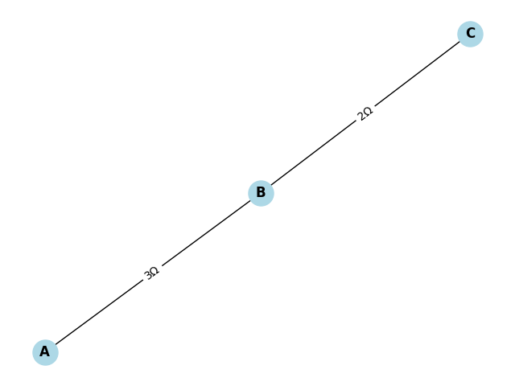
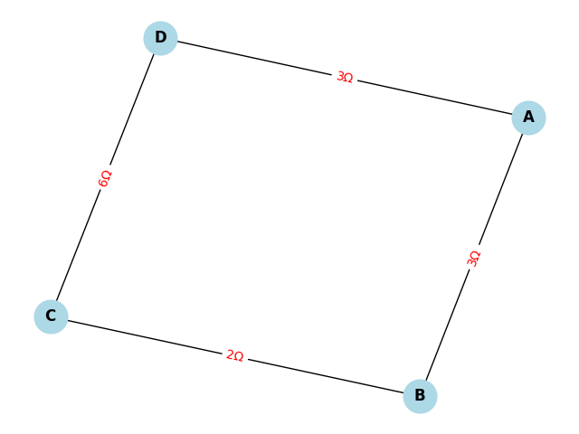

# Problem 1
# Problem 1: Equivalent Resistance Using Graph Theory

## 🎯 Motivation

Calculating equivalent resistance is a fundamental problem in electrical circuits, essential for understanding and designing efficient systems. While traditional methods involve iteratively applying series and parallel resistor rules, these approaches can become cumbersome for complex circuits with many components.

**Graph theory** offers a powerful alternative by representing a circuit as a graph—where:

- **Nodes** represent junctions.
- **Edges** represent resistors, with weights equal to resistance values.

This approach:
- Streamlines calculations.
- Enables automated analysis and circuit simulation.
- Highlights the connection between electrical engineering and computer science.

---

## ✅ Task Overview

We aim to calculate the equivalent resistance between two nodes in a circuit represented as a graph.

---

## Option 2: 🔁 Advanced Task – Full Implementation

### 🧠 Algorithm Description

#### Key Ideas:

- **Parallel Reduction**: If multiple resistors exist between two nodes, replace them with their parallel equivalent:

  $$
  \frac{1}{R_{eq}} = \sum_{i} \frac{1}{R_i}
  $$

- **Series Reduction**: If a node connects to exactly two other nodes via single resistors, replace the three-node chain with a single resistor:

  $$
  R_{eq} = R_1 + R_2
  $$

 ### 📄 Pseudocode

```plaintext
function calculate_equivalent_resistance(graph, start_node, end_node):
    while graph has more than one edge:
        for each pair of nodes (u, v) in graph:
            if multiple edges exist between u and v:
                // Parallel reduction
                R_eq = 1 / sum(1 / R_i for each R_i between u and v)
                remove all edges between u and v
                add a new edge with weight R_eq
            elif node v is connected to exactly two other nodes (u and w)
                 and only one resistor each:
                // Series reduction
                R1 = resistance(u, v)
                R2 = resistance(v, w)
                R_eq = R1 + R2
                remove nodes u-v-w
                add edge u-w with weight R_eq

    return resistance between start_node and end_node
```

### 🐍 Python Code (Using `networkx`)

```python
import networkx as nx

def simplify_circuit(G, start, end):
    changed = True
    while changed:
        changed = False

        # Handle parallel connections
        for u, v in list(G.edges()):
            edges = list(G.get_edge_data(u, v).values())
            if len(edges) > 1:
                req = 1 / sum(1 / d['resistance'] for d in edges)
                G.remove_edges_from([(u, v)] * len(edges))
                G.add_edge(u, v, resistance=req)
                changed = True

        # Handle series connections
        for node in list(G.nodes()):
            if node in (start, end):
                continue
            neighbors = list(G.neighbors(node))
            if len(neighbors) == 2:
                u, v = neighbors
                if (G.number_of_edges(node, u) == 1 and 
                    G.number_of_edges(node, v) == 1 and
                    len(list(G.edges(node))) == 2):
                    
                    r1 = list(G.get_edge_data(node, u).values())[0]['resistance']
                    r2 = list(G.get_edge_data(node, v).values())[0]['resistance']
                    req = r1 + r2

                    G.remove_node(node)
                    G.add_edge(u, v, resistance=req)
                    changed = True
                    break

    return list(G.get_edge_data(start, end).values())[0]['resistance']


 # Example 1: A - B - C in series with resistances 3Ω and 2Ω
G = nx.MultiGraph()
G.add_edge('A', 'B', resistance=3)
G.add_edge('B', 'C', resistance=2)

result = simplify_circuit(G, 'A', 'C')
print("Equivalent resistance:", result)  # Output: 5
# Example 2: Nested configuration with a parallel path
G2 = nx.MultiGraph()
G2.add_edge('A', 'B', resistance=3)
G2.add_edge('B', 'C', resistance=2)
G2.add_edge('C', 'D', resistance=6)
G2.add_edge('A', 'D', resistance=3)  # Parallel to the path A-B-C-D
print("Example 2 Equivalent Resistance:", simplify_circuit(G2, 'A', 'D'))  # Output: ~2.25
```
Example 1


Example 2


---

---

## Explanation of Results

In **Example 1**, the two resistors of 3Ω and 6Ω are connected in parallel between nodes A and B. The algorithm computes the equivalent resistance as 2Ω, which matches the theoretical calculation using the parallel resistor formula:

$$
R_{eq} = \frac{1}{\frac{1}{3} + \frac{1}{6}} = 2 \Omega
$$

In **Example 2**, there is a more complex configuration where the series path A-B-C-D has resistances of 3Ω, 2Ω, and 6Ω, summing to 11Ω, which is in parallel with a direct 3Ω resistor between A and D. The resulting equivalent resistance is approximately 2.25Ω, consistent with the parallel combination of 3Ω and 11Ω resistors.

---

## Discussion on Algorithm Behavior

- The algorithm identifies and reduces **parallel resistors** by combining all edges between two nodes into a single equivalent resistor using the reciprocal sum formula.
- It detects **series connections** as nodes connected to exactly two other nodes by single resistors and replaces the chain of three nodes with a single resistor whose resistance is the sum of the two.
- These reductions repeat iteratively until the graph is simplified to a single equivalent resistor between the specified start and end nodes.

---

## Complexity and Limitations

- The simplification algorithm iteratively processes the graph, so its time complexity depends on the number of nodes and edges. For typical circuit graphs, this is efficient, but the complexity can increase for very large or dense networks.
- The algorithm works well for circuits reducible by series and parallel combinations but may require enhancements to handle more complex topologies such as bridge circuits or networks requiring star-delta (Y-Δ) transformations.
- Potential improvements include incorporating these advanced transformations and optimizing graph traversal for faster reduction.

---

## Conclusion

Applying graph theory to calculate equivalent resistance provides a structured and programmable approach to circuit analysis. It simplifies complex resistor networks step-by-step, enabling automated analysis that is beneficial in engineering applications and educational contexts. This method effectively connects electrical engineering concepts with graph algorithms and data structures.


