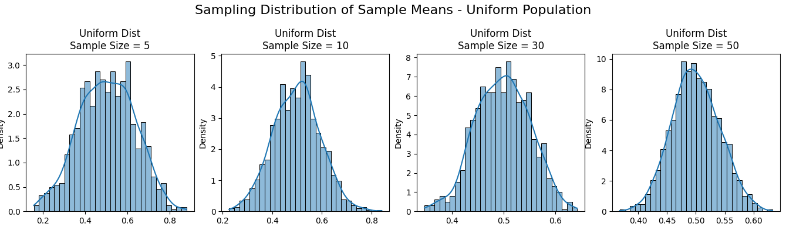
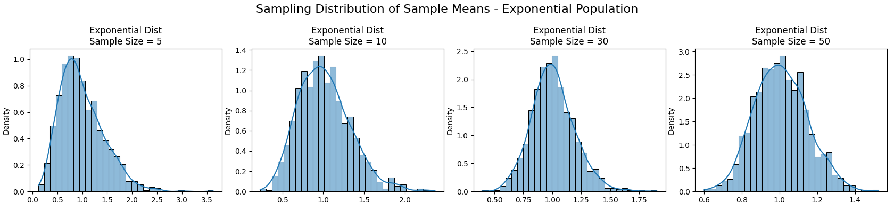
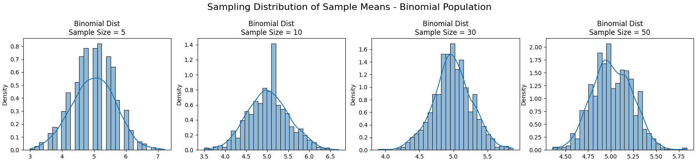

# Problem 1: Exploring the Central Limit Theorem through Simulations

## Motivation

The **Central Limit Theorem (CLT)** is a cornerstone of probability and statistics. It states that the sampling distribution of the sample mean approaches a **normal distribution** as the sample size increases, regardless of the population’s original distribution (as long as the variance is finite). Simulations provide an intuitive and hands-on way to observe this phenomenon in action.

---

## Task 1: Simulating Sampling Distributions

We consider the following population distributions:

- Uniform distribution: `U(0, 1)`
- Exponential distribution: `Exp(λ=1)`
- Binomial distribution: `Bin(n=10, p=0.5)`

Each distribution is used to generate a large dataset of 100,000 data points to simulate the full population.

```python
import numpy as np

# Set seed for reproducibility
np.random.seed(42)

# Population size
N = 100000

# Generate populations
uniform_pop = np.random.uniform(0, 1, N)
exponential_pop = np.random.exponential(1, N)
binomial_pop = np.random.binomial(10, 0.5, N)
```
## Task 2: Sampling and Visualization

For each population distribution (Uniform, Exponential, Binomial), we perform the following steps to visualize the Central Limit Theorem in action:

1. **Randomly sample data** from the population using various sample sizes:  
   - Sample sizes used: **5, 10, 30, and 50**

2. **Repeat the sampling process**:
   - Each sampling experiment is repeated **1000 times** to create a distribution of sample means.

3. **Compute the sample mean** for each of the 1000 samples.

4. **Plot the sampling distribution**:
   - A histogram of the 1000 sample means is created for each sample size.
   - Kernel Density Estimation (KDE) is optionally applied to better visualize the shape of the distribution.

These plots help demonstrate how the distribution of sample means converges toward a normal distribution as the sample size increases, even when the underlying population is non-normal.

```python
import matplotlib.pyplot as plt
import seaborn as sns

# Sample sizes
sample_sizes = [5, 10, 30, 50]

# Function to simulate sample means
def simulate_sample_means(population, sample_size, num_samples=1000):
    return [np.mean(np.random.choice(population, size=sample_size, replace=False))
            for _ in range(num_samples)]

# Plotting function
def plot_sampling_distributions(population, name):
    fig, axes = plt.subplots(1, len(sample_sizes), figsize=(20, 4))
    for i, size in enumerate(sample_sizes):
        sample_means = simulate_sample_means(population, size)
        sns.histplot(sample_means, kde=True, ax=axes[i], stat="density", bins=30)
        axes[i].set_title(f"{name} Dist\nSample Size = {size}")
    plt.suptitle(f"Sampling Distribution of Sample Means - {name} Population", fontsize=16)
    plt.tight_layout()
    plt.show()

# Generate plots
plot_sampling_distributions(uniform_pop, "Uniform")
plot_sampling_distributions(exponential_pop, "Exponential")
plot_sampling_distributions(binomial_pop, "Binomial")
```



## Task 3: Parameter Exploration

### Effect of Population Shape on Convergence

Different population distributions influence how quickly the sampling distribution of the mean approaches normality:

- **Uniform Distribution**: Symmetric and bounded; the sample means converge quickly to a normal distribution, even for small sample sizes.
- **Exponential Distribution**: Highly skewed; requires larger sample sizes for the sampling distribution to resemble a normal distribution.
- **Binomial Distribution**: Discrete but symmetric (when p = 0.5); converges quickly, especially with moderate or large sample sizes.

### Impact of Sample Size

The Central Limit Theorem shows that increasing the sample size improves the approximation of the sampling distribution to a normal curve.

$$
\sigma_{\bar{x}} = \frac{\sigma}{\sqrt{n}}
$$

As sample size `n` increases:
- The standard deviation of the sample mean (standard error) decreases.
- The histogram of sample means becomes more concentrated and bell-shaped.

### Observations from Simulations

- Smaller sample sizes (e.g., 5) result in a sampling distribution that still resembles the shape of the original distribution.
- Larger sample sizes (e.g., 30, 50) show clear convergence to a normal distribution regardless of the original population shape.
- Populations with high variance (e.g., exponential) produce wider sampling distributions.

---

## Task 4: Practical Applications of the Central Limit Theorem

The CLT has wide-ranging applications in both theoretical and applied fields:

### 1. Estimating Population Parameters
- Allows statisticians to construct confidence intervals around sample means.
- Justifies the use of normal approximations when calculating probabilities.

### 2. Quality Control in Manufacturing
- Sample means from production lines are used to detect defects or shifts in process performance.
- CLT ensures that control charts based on sample averages follow predictable behavior.

### 3. Financial Modeling and Risk Assessment
- Aggregated returns on investment portfolios often use CLT to justify normality assumptions.
- Facilitates the computation of risk metrics like Value at Risk (VaR).

---

## Conclusion

Through simulation, we have observed the Central Limit Theorem in action. The key takeaways are:

- Regardless of the original distribution (uniform, exponential, or binomial), the distribution of sample means becomes approximately normal as the sample size increases.
- The rate of convergence depends on the population’s shape and variance.
- Larger sample sizes lead to smaller variance in the sampling distribution and faster convergence.
- The CLT underpins many real-world statistical applications, from parameter estimation to process control and financial forecasting.

Simulations confirm the power and utility of the CLT, providing both intuitive and empirical evidence for one of statistics' most foundational theorems.
