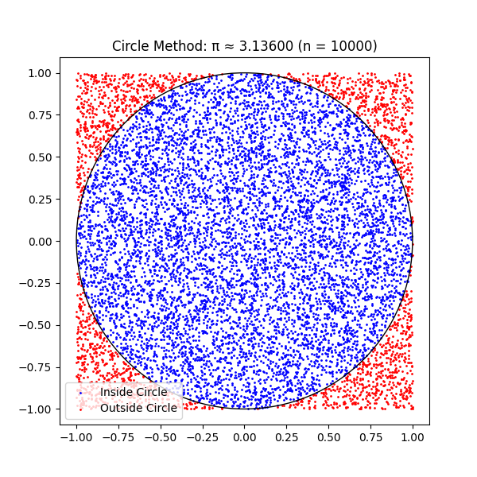
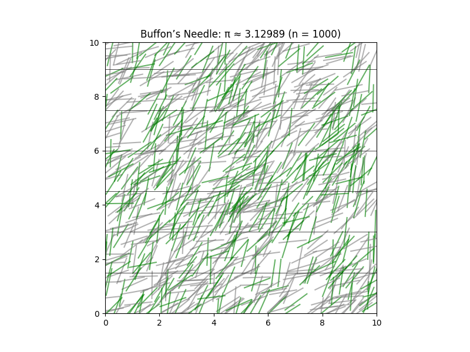

# Problem 2: Estimating π Using Monte Carlo Methods

## Motivation

Monte Carlo simulations use randomness to estimate values and solve complex problems. Estimating π is one of the most intuitive examples, showing how probability, geometry, and computational techniques can come together. We'll explore two methods:

- Estimating π using random points in a square and circle.
- Estimating π using Buffon’s Needle experiment.

---

## Part 1: Estimating π Using a Circle

### 1. Theoretical Foundation

We generate random points in a square bounding a unit circle. The ratio of the number of points that fall inside the circle to the total number of points approximates:

\[
\frac{\text{Points inside circle}}{\text{Total points}} \approx \frac{\pi}{4}
\]

Hence,

\[
\pi \approx 4 \times \frac{\text{Points inside circle}}{\text{Total points}}
\]

---

### 2. Simulation Code

```python
import numpy as np
import matplotlib.pyplot as plt

def estimate_pi_circle(n_points):
    x = np.random.uniform(-1, 1, n_points)
    y = np.random.uniform(-1, 1, n_points)

    inside_circle = x**2 + y**2 <= 1
    pi_estimate = 4 * np.sum(inside_circle) / n_points

    # Visualization
    plt.figure(figsize=(6, 6))
    plt.scatter(x[inside_circle], y[inside_circle], color='blue', s=1, label='Inside Circle')
    plt.scatter(x[~inside_circle], y[~inside_circle], color='red', s=1, label='Outside Circle')
    circle = plt.Circle((0, 0), 1, color='black', fill=False)
    plt.gca().add_artist(circle)
    plt.title(f"Circle Method: π ≈ {pi_estimate:.5f} (n = {n_points})")
    plt.axis('equal')
    plt.legend()
    plt.show()

    return pi_estimate

# Example usage:
estimate_pi_circle(10000)
```

### 3. Visualization

- **Blue dots** represent points inside the circle.
- **Red dots** are outside the circle.
- As the number of points increases, the estimate converges to **π**.

---

### 4. Analysis

- **Larger sample sizes** yield more accurate estimates.
- **Fast convergence** with increasing number of points.
- Very **intuitive** and **efficient** for parallel computation.

---

## Part 2: Estimating π Using Buffon’s Needle

### 1. Theoretical Foundation

Buffon’s Needle experiment drops a needle on a surface with equally spaced parallel lines. The probability \( P \) that a needle crosses a line is given by:

$$
P = \frac{2l}{\pi d}
$$

Rearranging the formula to solve for π:

$$
\pi \approx \frac{2l \cdot N}{d \cdot H}
$$

Where:

- \( l \) = length of the needle  
- \( d \) = distance between the lines  
- \( N \) = total number of needle drops  
- \( H \) = number of times the needle crosses a line  

### 2. Simulation Code

```python
import numpy as np
import matplotlib.pyplot as plt

def estimate_pi_buffon(n_drops, needle_length=1.0, line_spacing=1.5):
    hits = 0
    x_centers = []
    angles = []
    crosses = []

    for _ in range(n_drops):
        x_center = np.random.uniform(0, line_spacing / 2)
        theta = np.random.uniform(0, np.pi / 2)

        if (needle_length / 2) * np.sin(theta) >= x_center:
            hits += 1
            crosses.append(True)
        else:
            crosses.append(False)

        x_centers.append(x_center)
        angles.append(theta)

    if hits == 0:
        return None  # Avoid division by zero

    pi_estimate = (2 * needle_length * n_drops) / (hits * line_spacing)

    # Visualization
    plt.figure(figsize=(8, 6))
    for i in range(n_drops):
        x = np.random.uniform(0, 10)
        y = np.random.uniform(0, 10)
        angle = angles[i]
        dx = (needle_length / 2) * np.cos(angle)
        dy = (needle_length / 2) * np.sin(angle)
        x1, x2 = x - dx, x + dx
        y1, y2 = y - dy, y + dy
        color = 'green' if crosses[i] else 'gray'
        plt.plot([x1, x2], [y1, y2], color=color, alpha=0.6)

    for i in range(11):
        plt.axhline(i * line_spacing, color='black', linewidth=0.5)

    plt.title(f"Buffon’s Needle: π ≈ {pi_estimate:.5f} (n = {n_drops})")
    plt.xlim(0, 10)
    plt.ylim(0, 10)
    plt.gca().set_aspect('equal')
    plt.show()

    return pi_estimate

# Example usage:
estimate_pi_buffon(1000)
```

### 3. Visualization

- Each needle is drawn over horizontal lines.
- **Green:** crosses a line
- **Gray:** does not cross
- More drops lead to better approximation.

---

### 4. Analysis

- Estimates π probabilistically using trigonometry.
- Convergence is slower than the circle method.
- More complex logic and geometry, but historically significant.

---

## Final Analysis and Comparison

| Method          | Code Complexity | Convergence Speed | Accuracy | Visual Appeal |
|-----------------|-----------------|-------------------|----------|--------------|
| Circle Method   | Simple          | Fast              | High     | High         |
| Buffon’s Needle | Medium          | Slower            | Medium   | Medium       |

- The circle method is recommended for fast, accurate results.
- Buffon’s needle is a beautiful illustration of how geometry and probability can reveal deep mathematical truths.

---

## Summary

- Both methods estimate π using randomness.
- The circle-based method is more efficient and easier to implement.
- Buffon’s needle connects to classical probability and is valuable for educational purposes.
